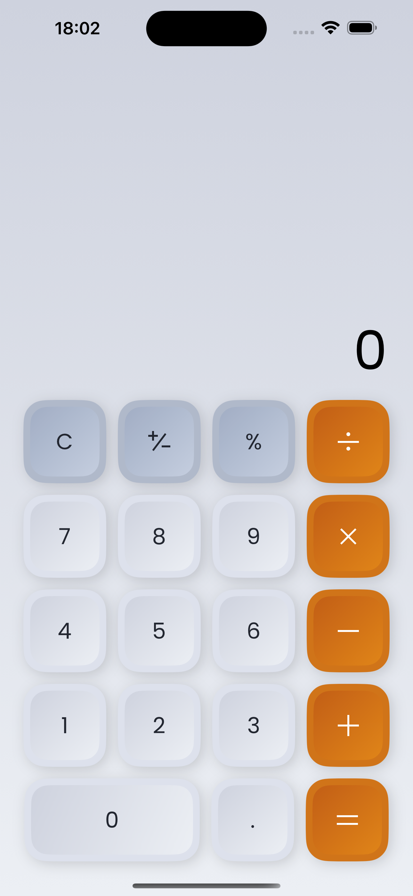
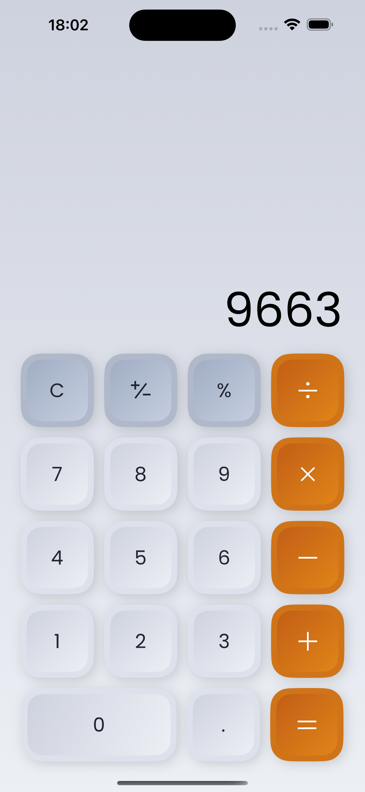

# Neumorphism Calculator

A modern calculator with a beautiful neumorphic design built using React Native and Expo.

## Features

- Clean and modern neumorphic design
- Basic arithmetic operations (addition, subtraction, multiplication, division)
- Responsive layout that works on all devices
- Smooth animations and interactions
- Clear and delete functionality
- Decimal point support
- Error handling for invalid operations
- Dark mode support

## Screenshots

<div style="display: flex; justify-content: space-between; margin: 20px 0;">
    
    
</div>

## Technologies Used

- React Native
- Expo
- TypeScript
- @shopify/restyle for theming
- React Navigation
- Expo Linear Gradient
- Expo Blur
- React Native SVG
- React Native Gesture Handler

## Prerequisites

- Node.js (LTS version)
- Yarn package manager
- Expo CLI
- iOS Simulator (for Mac) or Android Studio (for Android development)

## Getting Started

1. Clone the repository:
```bash
git clone https://github.com/KeabetsweFx/neumorphism-calculator.git
```

2. Install dependencies:
```bash
yarn install
```

3. Start the development server:
```bash
yarn start
```

4. Run on your preferred platform:
```bash
# For iOS
yarn ios

# For Android
yarn android
```

## Project Structure

```
src/
  ├── components/     # Reusable UI components
  ├── navigation/     # Navigation configuration
  ├── screens/        # Screen components
  ├── theme/          # Theme configuration and styles
  └── utils/          # Utility functions
```

## Usage

- Click the number buttons to input numbers
- Use operation buttons (+, -, ×, ÷) for calculations
- Press 'C' to clear the current input
- Press 'CE' to clear everything
- Press '=' to see the result
- Use '.' for decimal numbers

## Contributing

Contributions are welcome! Please feel free to submit a Pull Request.

## License

This project is licensed under the MIT License - see the LICENSE file for details.

## Acknowledgments

- Inspired by modern neumorphic design trends
- Built with ❤️ using React Native and Expo
